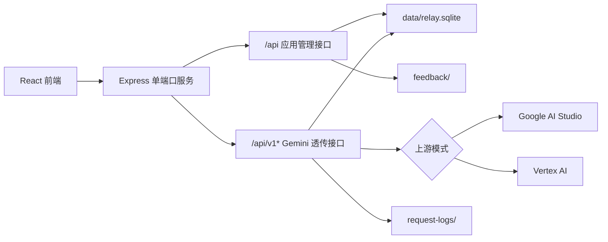

# 系统架构

本文只描述系统结构和模块边界。具体功能分别见同目录下的功能文档。

## 总体结构

Ema Powerbank 是单端口 Web 服务。Express 同时承载前端页面、应用管理接口和 Gemini REST 透传接口。



开发模式下，Express 使用 Vite middleware 服务前端。生产模式下，`npm run build` 生成：

- `dist/`：Vite 前端构建产物
- `dist-server/`：TypeScript 后端编译产物

`npm start` 运行 `node dist-server/index.js`，仍然由同一个 Express 进程服务静态页面和后端接口。

## 后端模块

- `server/index.ts`：Express 入口，注册 API 路由、Gemini 透传中间件、Vite/静态文件服务和统一错误处理。
- `server/auth.ts`：session cookie、JWT、密码哈希、API key 生成/哈希/查找、管理员鉴权。
- `server/db.ts`：SQLite 初始化、运行时目录创建、默认管理员、默认价格、上游配置和模型价格读写。
- `server/proxy.ts`：Gemini REST 透传、上游请求构造、Vertex embedding 兼容转换、审计日志和用量记录。
- `server/billing.ts`：用量提取、embedding 用量归一化、费用计算、扣费和统计聚合。
- `server/googleProvider.ts`：上游配置校验、AI Studio/Vertex 配置规范化、Vertex access token 获取。
- `server/feedback.ts`：multipart 解析、反馈包保存、附件校验、反馈分页、CSV 导出和审核锁。
- `server/types.ts`：后端共享类型。
- `server/smoke-test.ts`：构建后 smoke test。

## 前端模块

- `src/App.tsx`：主要页面和交互逻辑，包括登录、面板、管理、日志、反馈和反馈审核。
- `src/api.ts`：带 cookie 的 fetch 封装，普通对象自动 JSON 序列化，FormData 等原生 body 直接透传。
- `src/types.ts`：前端接口数据类型。
- `src/i18n.ts`：中英文文案。
- `src/styles.css`：全局样式、响应式布局、暗色主题和弹层样式。
- `src/lib/navigation.ts`：按角色生成导航项。
- `src/lib/feedbackAttachments.ts`：反馈附件校验、拖拽/粘贴图片处理、本地预览 URL 管理。
- `src/lib/format.ts`：金额、数字、日期、日志和 JSON 格式化。
- `src/lib/usage.ts`：用量统计和图表数据处理。
- `src/lib/timing.ts`：请求耗时分段展示。
- `src/lib/models.ts`：内置 API 测试面板的模型默认请求体和路径。

## 接口分层

应用管理接口统一位于 `/api` 下，通过 session cookie 鉴权。管理员接口额外使用 `requireAdmin`。

Gemini 透传接口匹配 `/api/v1*`，例如：

- `/api/v1beta/models/{model}:generateContent`
- `/api/v1beta/models/{model}:streamGenerateContent`
- `/api/v1beta/models/{model}:batchEmbedContents`

`server/index.ts` 会先把 `/api/v1*` 请求交给 `proxyMiddlewares`，避免这类请求落入普通 JSON body parser。

## 数据目录

启动时自动创建：

```text
data/
request-logs/
feedback/
```

- `data/relay.sqlite`：用户、API key、上游配置、价格和用量索引。
- `request-logs/`：每次透传请求的完整 JSON 审计文件。
- `feedback/`：每次反馈提交的包目录、`feedback.json` 和图片附件。

## SQLite 表

| 表 | 作用 |
| --- | --- |
| `users` | 用户、管理员、密码哈希、角色、余额 |
| `api_keys` | 用户 API key 哈希、可复制明文、前缀、创建/使用/撤销时间 |
| `settings` | 上游配置、默认价格 seed 版本等键值配置 |
| `pricing` | 模型价格，按模型 ID 唯一 |
| `usage_records` | 每次透传请求的索引、用量、费用、耗时和审计文件路径 |

## 权限边界

- session cookie 用于页面和应用管理接口。
- `ep_` API key 用于 Gemini 透传接口。
- 普通用户只能访问自己的 API key、面板数据和请求日志。
- 管理员可以访问管理接口、所有请求日志和反馈审核接口。
- 请求日志详情和反馈附件读取都有路径边界检查，防止读取运行时目录之外的文件。
